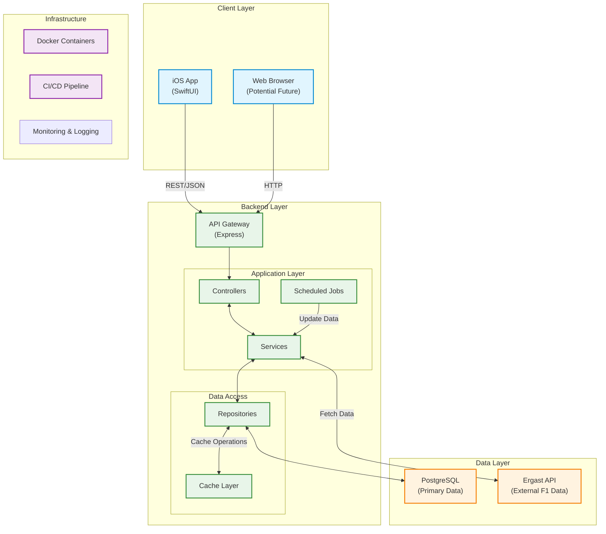

# 🏎️ Formula 1 World Champions App

A full-stack application that showcases Formula 1 World Champions and race results. This project demonstrates modern full-stack development skills including API design, database modeling, automated testing, CI/CD, and native iOS development.

## 🚀 Features

### Backend
- **RESTful API** built with Node.js and Express
- **PostgreSQL** database with Prisma ORM for type-safe database access
- **Redis** caching layer for improved performance
- **Docker** containerization for consistent development and deployment
- **Automated Testing** with comprehensive test coverage
- **Swagger/OpenAPI** documentation for all API endpoints
- **Scheduled Jobs** for refreshing champion data

### iOS App (SwiftUI)
- Native iOS application with support for all iPhone screen sizes
- Clean, intuitive user interface following Apple's Human Interface Guidelines
- Responsive design
- Comprehensive error handling and loading states

> 🤖 **Fun Fact:** The entire iOS app's visual design was crafted using AI - from the app icon to the screens, lists, and even the Formula 1 loading logo! Generated with OpenAI's GPT-4.1 model, this showcases the power of AI in modern app development! 🚀

## 🏗️ System Architecture



*For a more detailed architecture diagram, see [High Level Architecture Flowchart](./backend/docs/diagrams/high_level_system_architecture_flowchart/high_level_system_architecture_flowchart.md)*

**Note: Diagrams looks better in light mode vs dark mode.

## 🛠️ Tech Stack

### Backend
- **Runtime**: Node.js
- **Framework**: Express.js
- **Database**: PostgreSQL with Prisma ORM
- **Caching**: Redis
- **Containerization**: Docker & Docker Compose
- **API Documentation**: Swagger/OpenAPI
- **Testing**: Jest, Supertest
- **CI/CD**: GitHub Actions

### iOS App
- **Language**: Swift 5
- **UI Framework**: SwiftUI
- **Minimum iOS Version**: iOS 15.0+
- **Dependencies**: None (intentionally kept minimal)

## 🚀 Getting Started

### Prerequisites

- **For Backend**:
  - Docker Desktop (latest version)
  
  - If only want to run BE separately without docker
    - Node.js 18+
    - npm or yarn

- **For iOS**:
  - Xcode 14.0+
  - macOS 12.0+
  - iOS 15.0+ device or simulator

### Running the Backend
** Make sure Docker Daemon/Desktop is running before starting the backend.**

1. **Start All Services with Docker Compose**
   ```bash
   cd infrastructure
   docker-compose up --build
   ```
   
   This single command will set up everything you need:
   - Build the backend Docker image
   - Start PostgreSQL database with initial schema
   - Set up Redis cache
   - Run database migrations
   - Seed initial data (F1 seasons, and drivers)
   - Start the backend server
   - Launch pgAdmin (available at http://localhost:8080)

   **Note on First Run**: The initial setup might take a few minutes as it needs to:
   - Build Docker images
   - Initialize the database, run migrations, Redis cache, ...etc
   - Seed all F1 historical data
   
   Wait until you see this in the logs before proceeding:
   ```
   backend-1  | > backend@1.0.0 start
   backend-1  | > node index.js
   backend-1  | 
   backend-1  | Scheduling F1 data refresh cron job: */5 * * * *
   backend-1  | Backend API listening at http://localhost:3000
   backend-1  | Connected to Redis at redis:6379
   ```
   
   Subsequent starts will be much faster as the database and cache persist between restarts and you only need to run 
    ```bash
   docker-compose up
   ```
   for any subsequent starts.

2. **Access the Application and APIs**
   - API: `http://localhost:3000`
   - Health check : `http://localhost:3000/health`
   - Seasons API: `http://localhost:3000/api/seasons`
   - Races API: `http://localhost:3000/api/seasons/2025/races`
   - Drivers API: `http://localhost:3000/api/seasons/2025/drivers`

5. **Access API Documentation and Admin Tools**
   - Swagger UI: `http://localhost:3000/api-docs`
   - pgAdmin: `http://localhost:5050` (email: `admin@admin.com`, password: `admin`)

### Running the iOS App

1. Open the Xcode workspace:
   ```bash
   cd frontend/Formula1
   open Formula1.xcodeproj
   ```

2. Select a simulator or connect an iOS device

3. Press `Cmd + R` to build and run the app

## 🧪 Testing

### Backend Tests
```bash
cd backend
npm run test --coverage
```

### iOS Tests
1. Open the Xcode project
2. Press `Cmd + U` to run all tests locally and see result and coverage report.

Also Test coverage reports are generated in the CI/CD pipeline and can be downloaded unpacked and opened in Xcode and viewed in the GitHub Actions artifacts.

## 📁 Project Structure

### Backend (`/backend`)
```
backend/
├── src/                      # Source code
│   ├── config/               # Configuration files
│   ├── controllers/          # Request handlers and route definitions
│   ├── routes/               # API route definitions
│   ├── services/             # Business logic
│   ├── utils/                # Utility functions and helpers
├── tests/                    # Test files with
├── prisma/                   # Database schema and migrations
└── docs/                     # Comprehensive documentation
    ├── diagrams/             # System architecture diagrams
    ├── api_design_decision.md
    ├── backend_initial_architecture_decision.md
    ├── caching_strategy.md
    ├── database_schema.md
    ├── dependencies.md
    ├── folder_structure.md
    ├── linting_setup_and_decisions.md
    ├── seeding_script.md
    ├── sync_seasons_cron_job.md
    └── testing_strategy.md
```

### iOS App (`/frontend/Formula1`)
```
Formula1/
├── Formula1/                # Main app code
│   ├── Models/              # Data models
│   ├── Views/               # SwiftUI views
│   ├── ViewModels/          # ViewModels for MVVM
│   ├── Services/            # Network and data services
│   ├── Utils/               # Extensions and helpers
├── Formula1Tests/           # Unit tests
├── Formula1UITests/         # UI tests
└── docs/                    # iOS-specific documentation
    ├── diagrams/            # UI/UX flow diagrams
    ├── error_handling.md
    ├── folder_structure.md
    ├── frontend_initial_architecture_decision.md
    ├── ios_app_structure.md
    ├── mvvm.md
    ├── testing_strategy.md
    └── ui_design_guide.md
```

### Infrastructure (`/infrastructure`)
```
infrastructure/
├── docs/                    # Infrastructure documentation
│   ├── ci_cd_pipeline_plan.md
│   ├── cicd_pipeline_initial_architecture_decision.md
│   ├── containerization_initial_architecture_decision.md
│   ├── docker.md
│   ├── git_flow_strategy.md
│   └── screenshots/         # Infrastructure-related screenshots
└── docker-compose.yml        # Main Docker Compose configuration
```

### Documentation Structure
- **Backend Documentation**: Located in `/backend/docs`, contains comprehensive documentation about the backend architecture, API design, database schema, and implementation decisions.

- **iOS App Documentation**: Located in `/frontend/Formula1/Formula1/docs`, covers iOS app architecture, UI/UX decisions, and implementation details.

- **Infrastructure Documentation**: Located in `/infrastructure/docs`, focuses solely on infrastructure-related topics including Docker setup, CI/CD pipeline configuration, and deployment strategies.

**Note on Initial Architecture Decision Files**:
- Files named `*_initial_architecture_decision.md` document the initial research, trade-offs, and decision-making process at the start of the project.
- These files represent the initial thinking and may not reflect the final implementation.
- For current implementation details, refer to the other documentation files in each respective directory.

## 🔄 CI/CD Pipeline

The project uses GitHub Actions for continuous integration and deployment. The pipeline includes:

1. **Backend Pipeline**:
   - Linting and formatting checks
   - Unit and integration tests
   - Test coverage reporting
   - Docker image building and pushing

2. **iOS Pipeline**:
   - Build and test on multiple iOS versions
   - Generate test coverage reports
   - Create test artifacts

View the pipeline status and logs in the [GitHub Actions](https://github.com/kihab/f1-app/actions) tab.

## 📚 Documentation

For more detailed documentation, please refer to:

- [API Documentation](./backend/docs/api_design_decision.md)
- [Caching Strategy](./backend/docs/caching_strategy.md)
- [Seeeding Script](./backend/docs/seeeding_script.md)
- [Sync Seasons Cron Job](./backend/docs/sync_seasons_cron_job.md)
- [Dependencies](./backend/docs/dependencies.md)
- [Folder Structure](./backend/docs/folder_structure.md)
- [Backend Diagrams and screenshots](./backend/docs/diagrams)
- [Database Schema](./backend/docs/diagrams/erd_database/erd_database_schema.md)
- [Backend Testing Strategy](./backend/docs/testing_strategy.md)
- [Frontend Diagrams and screenshots](./frontend/Formula1/Formula1/docs/diagrams)
- [Frontend Testing Strategy](./frontend/Formula1/Formula1/docs/testing_strategy.md)
- [CI/CD Pipeline](./infrastructure/docs/ci_cd_pipeline_plan.md)
- [Docker](./infrastructure/docs/docker.md)

---
> 🤖 **Fun Fact:** The entire iOS app's visual design was crafted using AI - from the app icon to the screens, lists, and even the Formula 1 loading logo! Generated with OpenAI's GPT-4.1 model, this showcases the power of AI in modern app development! 🚀

Built by [Kihab](https://github.com/kihab)
