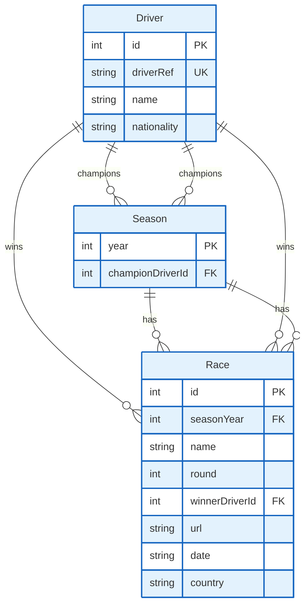

# F1 App - Database Schema (ERD)

## Database Schema Overview

### 1. Driver
Represents F1 drivers with their basic information.
- **id**: Primary key, auto-incrementing integer
- **driverRef**: Unique reference identifier for the driver (e.g., "hamilton")
- **name**: Full name of the driver
- **nationality**: Driver's nationality (optional)

### 2. Season
Represents an F1 season (year) and its champion.
- **year**: Primary key, 4-digit year (e.g., 2023)
- **championDriverId**: Foreign key to the Driver who won the championship

### 3. Race
Represents individual races within a season.
- **id**: Primary key, auto-incrementing integer
- **seasonYear**: Foreign key to the Season this race belongs to
- **name**: Official name of the race (e.g., "British Grand Prix")
- **round**: Race number in the season (1-based)
- **winnerDriverId**: Foreign key to the Driver who won this race
- **url**: Official race URL (optional)
- **date**: Race date in YYYY-MM-DD format (optional)
- **country**: Country where the race took place (optional)

## Relationships

1. **Driver to Season (One-to-Many)**
   - A driver can be champion in multiple seasons
   - Each season has exactly one champion driver

2. **Driver to Race (One-to-Many)**
   - A driver can win multiple races
   - Each race has exactly one winning driver

3. **Season to Race (One-to-Many)**
   - A season contains multiple races
   - Each race belongs to exactly one season

## Constraints

### Unique Constraints
- **Driver.driverRef**: Must be unique across all drivers
- **Race(seasonYear, round)**: The combination of season year and round number must be unique

### Indexes
- **Season.championDriverId**: For faster lookups of a driver's championship seasons
- **Race.seasonYear**: For faster filtering of races by season
- **Race.winnerDriverId**: For faster lookups of a driver's race wins

## Notes
- The schema is designed to efficiently track race winners and season champions
- Optional fields (like URL, date, country) provide additional race context
- The data model supports historical F1 data while maintaining referential integrity
- The schema is normalized to reduce data redundancy
