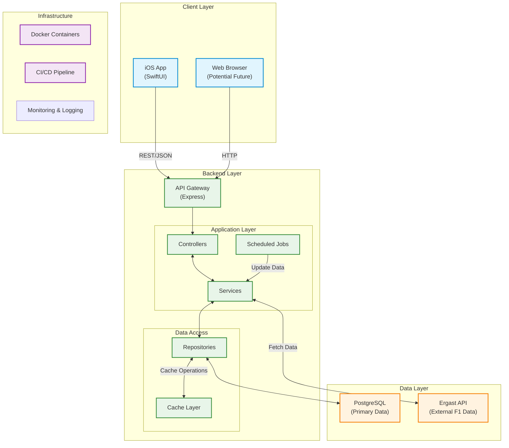

# F1 App - High Level System Architecture

## Components Overview

- **iOS App**: Native SwiftUI application for mobile users
- **Web Browser**: Potential web interface for future expansion

### 2. Backend Layer
- **API Gateway**: Entry point for all client requests
- **Controllers**: Route handling and request validation
- **Services**: Core business logic implementation
- **Scheduled Jobs**: Automated tasks (e.g., Champion Data Refresh)
- **Repositories**: Data access abstraction
- **Cache Layer**: Performance optimization

### 3. Data Layer
- **PostgreSQL**: Primary database for application data
- **Ergast API**: External source for F1 historical data

### 4. Infrastructure
- **Docker**: Containerization for consistent environments
- **CI/CD**: Automated testing and deployment pipeline
- **Monitoring**: System health and performance tracking

## Data Flow
1. Clients make HTTP requests to the API Gateway
2. Controllers validate and route requests to appropriate services
3. Services implement business logic and coordinate data access
4. Repositories handle data operations with the database and cache
5. External API calls are made to Ergast when needed
6. Responses are formatted and returned to clients

## Key Features
- RESTful API architecture
- Background job processing
- Caching for improved performance
- Comprehensive testing coverage (>99%)
- Containerized deployment