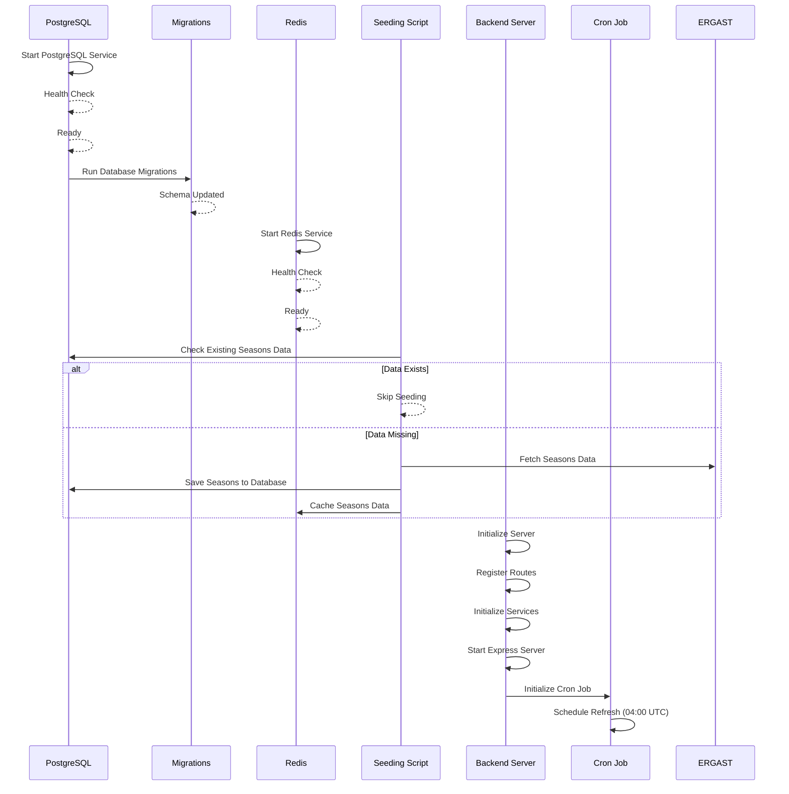

# F1 App - Backend Startup Sequence

## Backend Startup Flow Overview

### 1. Service Initialization
1. **PostgreSQL Database**
   - Starts as first service
   - Runs health checks
   - Ready for migrations

2. **Database Migrations**
   - Runs after DB is healthy
   - Creates/updates schema
   - Ensures correct database structure

3. **Redis Cache**
   - Starts independently
   - Runs health checks
   - Ready for seeding

### 2. Data Seeding Process
1. **Initial Data Check**
   - Checks for existing seasons data
   - Skips seeding if data exists

2. **Data Population**
   - Fetches data from Ergast API
   - Saves to PostgreSQL
   - Caches in Redis
   - Ensures instant FE experience

### 3. Backend Server Startup
1. **Server Initialization**
   - Starts after all dependencies
   - Registers routes
   - Initializes services
   - Starts Express server

2. **Cron Job Setup**
   - Initializes weekly refresh job
   - Schedules for 04:00 UTC
   - Ensures data stays current

## Key Points
- All services must be healthy before proceeding
- Seeding ensures instant FE experience
- Cron job maintains data freshness
- Follows dependency injection pattern
- Uses health checks for reliability
