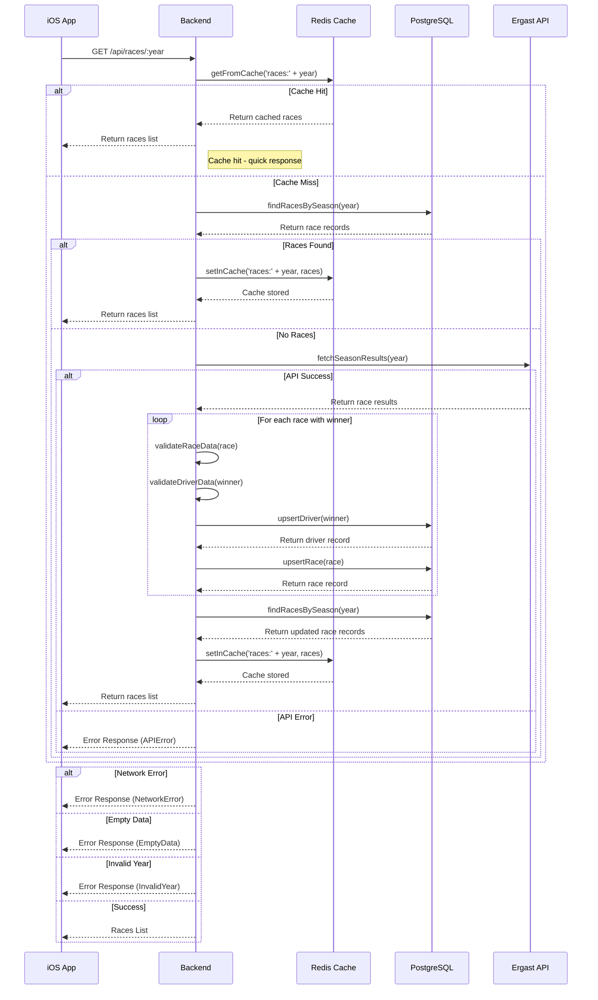

# F1 App - Races Flow Sequence

## Races Flow Overview

### 1. iOS App Flow
1. **ViewModel Request**
   - `RacesViewModel` makes request to Backend
   - Passes specific season year
   - Checks network connectivity
   - Shows loading indicator
   - Handles errors gracefully

2. **Error States**
   - Offline mode handling
   - Empty data handling
   - Network error handling
   - Invalid year handling
   - Retry mechanism available

### 2. Backend Processing
1. **Cache Check**
   - First checks Redis cache using `getFromCache`
   - Returns immediately if cache hit with timing logs

2. **Database Fast Path**
   - Queries races for specific year using `findRacesBySeason`
   - Returns from cache if races exist
   - Updates cache before returning response

3. **API Data Fetch**
   - Fetches race results from Ergast API using `fetchSeasonResults`
   - Filters races with winners
   - Validates race and driver data
   - Upserts drivers and races in database

4. **Caching**
   - Stores processed data in Redis cache using `setInCache`
   - Uses TTL for cache freshness
   - Logs cache update status

### 3. Response Flow
1. **Cache Hit**
   - Returns data from Redis cache
   - Logs cache hit and timing information

2. **Cache Miss**
   - Tries database first (fast path)
   - Falls back to API if no data exists
   - Updates cache before returning response
   - Logs cache update and timing information

3. **Error Handling**
   - Validates year before processing
   - Handles API errors gracefully
   - Provides proper error responses for network and data issues
   - Logs errors during processing

### 4. Logging
1. **Cache Operations**
   - Logs cache hits and misses
   - Logs cache update status
   - Logs timing information for operations

2. **Data Processing**
   - Logs start of operations
   - Logs data processing steps
   - Logs final response timing
   - Logs errors during processing

This sequence diagram accurately reflects the actual implementation in the system, showing the proper flow of data through the cache, database, and API layers, with appropriate error handling and logging at each step. The flow is optimized with a fast path that checks the database first before falling back to the API, and maintains cache consistency throughout the process.
