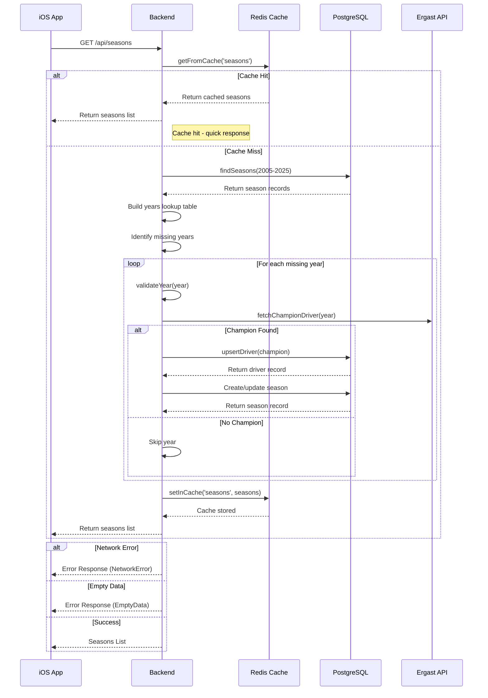

# F1 App - Seasons Flow Sequence

## Seasons Flow Overview

### 1. iOS App Flow
1. **ViewModel Request**
   - `SeasonsViewModel` makes request to Backend
   - Checks network connectivity
   - Shows loading indicator
   - Handles errors gracefully

2. **Error States**
   - Offline mode handling
   - Empty data handling
   - Network error handling
   - Retry mechanism available

### 2. Backend Processing
1. **Cache Check**
   - First checks Redis cache using `getFromCache`
   - Returns immediately if cache hit with timing logs

2. **Database Query**
   - Queries seasons from 2005 to current year using `findSeasons`
   - Creates lookup table for existing years
   - Identifies missing years

3. **Data Processing**
   - For each missing year:
     - Validates year using `validateYear`
     - Fetches champion from Ergast API using `fetchChampionDriver`
     - Upserts driver if needed using `upsertDriver`
     - Creates season record using `create/update season`

4. **Caching**
   - Stores processed data in Redis cache using `setInCache`
   - Uses TTL for cache freshness
   - Logs cache update status

### 3. Response Flow
1. **Cache Hit**
   - Returns data from Redis cache
   - Logs cache hit and timing information

2. **Cache Miss**
   - Processes data through database and API
   - Updates cache before returning response
   - Logs cache update and timing information

3. **Error Handling**
   - Validates year before processing
   - Handles missing champion data gracefully
   - Provides proper error responses for network and data issues

### 4. Logging
1. **Cache Operations**
   - Logs cache hits and misses
   - Logs cache update status
   - Logs timing information for operations

2. **Data Processing**
   - Logs start of operations
   - Logs data processing steps
   - Logs final response timing

This sequence diagram accurately reflects the actual implementation in the system, showing the proper flow of data through the cache, database, and API layers, with appropriate error handling and logging at each step.
     - Upserts driver if needed
     - Creates season record

4. **Caching**
   - Stores processed data in Redis cache
   - Uses TTL for cache freshness

### 3. Response Flow
1. **Success Case**
   - Returns complete seasons list
   - Includes champions where available
   - Handles gaps in data gracefully

2. **Error Cases**
   - Network errors handled by iOS app
   - Empty data cases handled gracefully
   - Error messages are user-friendly

## Key Features
- **Caching Layer**: Improves performance with Redis
- **Gap Handling**: Properly handles missing years
- **Error Recovery**: Graceful error handling
- **Network Awareness**: Offline mode support
- **Data Validation**: Validates all inputs/outputs
- **Dependency Injection**: Testable architecture
