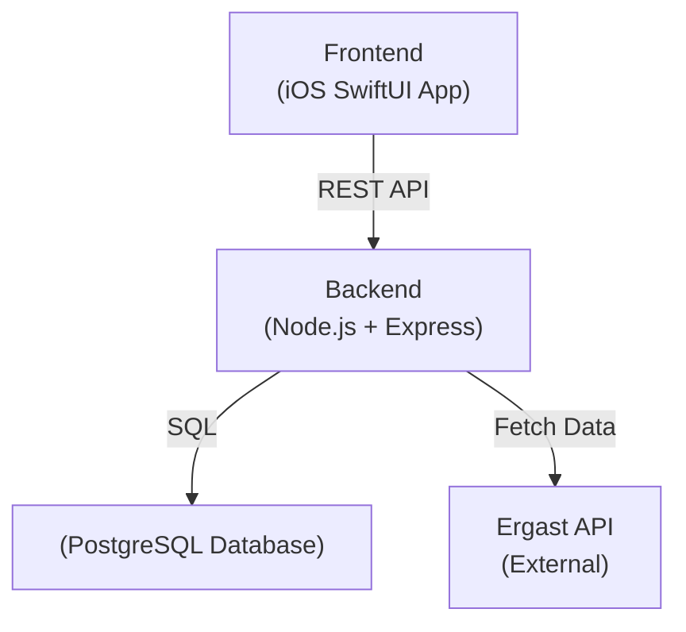

## System Architecture

```mermaid
graph TD
    FE["Frontend<br/>(iOS SwiftUI App)"]
    BE["Backend<br/>(Node.js + Express)"]
    DB["(PostgreSQL Database)"]
    ERGAST["Ergast API<br/>(External)"]

    FE -->|REST API| BE
    BE -->|SQL| DB
    BE -->|Fetch Data| ERGAST
```