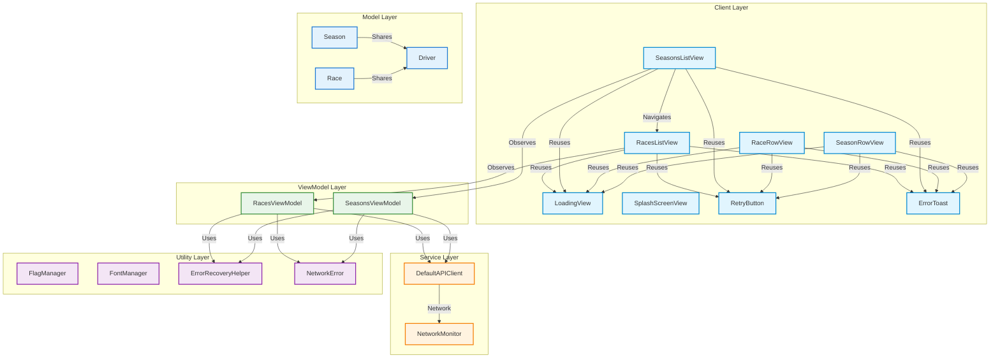

# F1 App - iOS High Level System Architecture

## Components Overview

### 1. Client Layer (UI Components)
- **SeasonsListView**: Main screen displaying list of seasons
- **RacesListView**: Screen showing races for a selected season
- **SeasonRowView**: Reusable component for displaying individual season
- **RaceRowView**: Reusable component for displaying individual race
- **LoadingView**: Reusable loading indicator with shimmer animation
- **SplashScreenView**: App launch screen with F1 branding
- **RetryButton**: Reusable button for retry actions
- **ErrorToast**: Toast-style error notification component

### 2. ViewModel Layer
- **SeasonsViewModel**: Manages seasons data and state
  - Handles API requests for seasons
  - Manages loading and error states
  - Provides data to SeasonsListView

- **RacesViewModel**: Manages races data and state
  - Handles API requests for races
  - Manages loading and error states
  - Provides data to RacesListView

### 3. Service Layer
- **DefaultAPIClient**: Handles network requests
  - Implements API protocol
  - Uses URLSession for network requests
  - Handles error mapping and response parsing

- **NetworkMonitor**: Monitors network connectivity
  - Provides real-time network status updates
  - Used by ViewModels for offline handling

### 4. Utility Layer
- **FlagManager**: Converts country codes to flag emojis
- **FontManager**: Centralizes font styling
- **ErrorRecoveryHelper**: Provides user-friendly error recovery options
- **NetworkError**: Custom error types for network operations

### 5. Model Layer
- **Season**: Data model for seasons
  - Year
  - Champion driver
  - Race count

- **Race**: Data model for races
  - Round number
  - Name
  - Date
  - Location
  - Winner driver

- **Driver**: Shared model for drivers
  - ID
  - Name
  - Nationality
  - DriverRef

## Key Features

### 1. MVVM Architecture
- **Separation of Concerns**:
  - Views handle UI presentation only
  - ViewModels manage business logic and state
  - Models represent pure data
  - Services handle data fetching

- **State Management**:
  - ViewModels expose @Published properties
  - Views observe ViewModel state changes
  - State updates trigger UI refresh

### 2. Component Reusability
- **Reusable UI Components**:
  - Loading indicators
  - Error handling
  - Retry mechanisms
  - Flag display

- **Shared Models**:
  - Driver model shared between seasons and races
  - Consistent data structures
  - Single source of truth

### 3. Error Handling
- **Comprehensive Error System**:
  - Network error handling
  - Offline mode support
  - User-friendly error messages
  - Retry mechanisms

### 4. Navigation
- **Clean Navigation Flow**:
  - Seasons list → Races list
  - Shared navigation stack
  - State preserved across screens

This architecture diagram shows how the iOS app is structured using MVVM pattern, with clear separation of concerns between UI components, business logic, data services, and models. The flow demonstrates how data moves through the system while maintaining a clean separation between presentation and logic layers.
