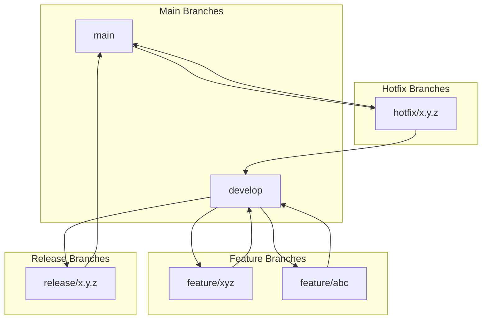

# Git Flow Strategy Documentation

## Standard Git Flow Strategy

### Branching Model



### Key Branches and Their Purposes

1. **main** (or master)
   - Contains production-ready code
   - Always stable and deployable
   - Protected branch with strict access controls

2. **develop**
   - Integration branch for features
   - Contains the latest development changes
   - Next release in progress

3. **Feature Branches** (feature/xyz)
   - Created from: develop
   - Purpose: Implementing new features
   - Merged back to: develop
   - Naming convention: feature/[feature-name]

4. **Release Branches** (release/x.y.z)
   - Created from: develop
   - Purpose: Preparing for production release
   - Merged back to: main and develop
   - Naming convention: release/[version]

5. **Hotfix Branches** (hotfix/x.y.z)
   - Created from: main
   - Purpose: Emergency fixes for production
   - Merged back to: main and develop
   - Naming convention: hotfix/[version]

### Workflow Process

1. **Feature Development**
   ```bash
   # Create feature branch
   git checkout -b feature/new-feature develop
   
   # Work on feature
   git add .
   git commit -m "Implement new feature"
   
   # Merge back to develop
   git checkout develop
   git merge feature/new-feature
   git branch -d feature/new-feature
   ```

2. **Release Preparation**
   ```bash
   # Create release branch
   git checkout -b release/1.0.0 develop
   
   # Prepare for release (bug fixes, testing)
   
   # Merge to main and develop
   git checkout main
   git merge release/1.0.0
   git tag -a v1.0.0 -m "Release 1.0.0"
   
   git checkout develop
   git merge release/1.0.0
   git branch -d release/1.0.0
   ```

3. **Hotfix Process**
   ```bash
   # Create hotfix branch
   git checkout -b hotfix/1.0.1 main
   
   # Fix the issue
   
   # Merge to main and develop
   git checkout main
   git merge hotfix/1.0.1
   git tag -a v1.0.1 -m "Hotfix 1.0.1"
   
   git checkout develop
   git merge hotfix/1.0.1
   git branch -d hotfix/1.0.1
   ```

## Simplified Approach in This Project

For this specific project, I've adopted a simplified Git Flow approach due to:

1. **Solo Development**
   - Working alone on the project
   - No need for complex branching
   - Reduced overhead of branch management

2. **Project Scope**
   - Small-scale project
   - Limited features
   - Rapid development required

3. **Development Approach**
   - Used `main` as the development branch
   - Minimal feature branching
   - Direct commits to main for simplicity

This simplified approach, while not following strict Git Flow, was chosen to:
- Speed up development
- Reduce overhead
- Focus on implementation
- Maintain a clean history

In a professional setting, I would always follow the standard Git Flow strategy for:
- Better collaboration
- Clearer history
- Proper release management
- Easier maintenance
- Better team coordination

The simplified approach used here is not recommended for production projects and is only used due to the specific constraints of this assignment.
